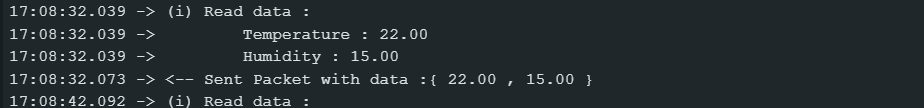

# 8INF924 - Laboratoire 3

## Introduction

Au sein de ce dépôt vous trouverez l'ensemble des livrables du Laboratoire 3 du cours "8INF924 - Internet of Things" de l'UQAC. Ce projet a été réalisé par :

- Valentin THEDON - THEV10079801

Dans ce README, nous répondrons à l'ensemble des questions du TP et expliciterons notre démarche.

## Environnement

### Hardware

- [Arduino MKR WAN 1310](https://docs.arduino.cc/hardware/mkr-wan-1310)
- [Capteur DHT11](http://www.aosong.com/m/en/products-21.html)

### Software
- Arduino IDE
- The Things Network

## Exercice 1

Pour cette exercice, il suffit de reperer à l'aide de la documentation le positionnement des pin sur le capteur et de bien brancher ces derniers au microcontrôleur.

Nous repérons aussi à l'aide de la documentation, l'existence d'une librairie permettant de lire et comprendre les données envoyé par le capteur :
- [DHT sensor library](https://www.arduino.cc/reference/en/libraries/dht-sensor-library/)

Nous examinons, le code `DHTtester.ino`, et nous comprenons le fonctionnement de la librairie.

Cela nous permets d'afficher les sorties capteurs en console : 

## Exercice 2

Pour la deuxième partie, nous connectons notre microcontrôleur à The Things Network. Pour ce faire nous créons une application sur l'interface web, y ajouton notre module Lora. Afin d'interpreter les trames recus par le microcontrôleur, nous utiliserons un *Payload Formatter*, qui se trouve dans le fichier `decoder.js`.

Nous pouvons donc observer nos données arriver sur TTN :

## Exercice 3

### 1
Les grands acteurs de l'IoT sont les grand groupes comme Amozon, Google, etc mais aussi les start-up comme Samsara, Losant, etc.

### 2 
L'utilisation de codes orthogonaux permet de s'affranchir du bruit car chaque bit du message est multiplié par un code d'étalement.

### 3
Faux cela correspond à un groupement de 512, soit 2 puissance 9

### 4 

Dans ce cas là `Rb = 4.88`

### 5 

Le CRC permet de detecter les eventuels erreurs de transmission grace à l'utilisation de données redondantes.
